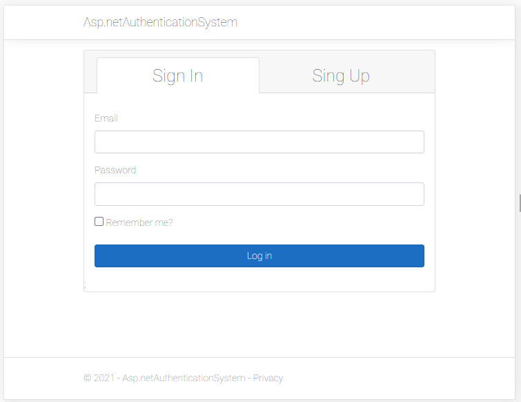
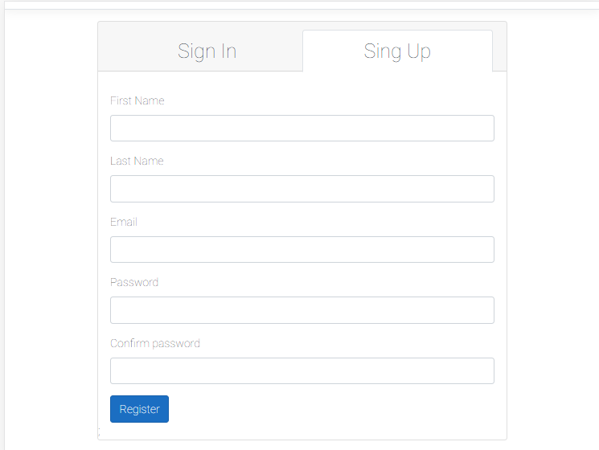
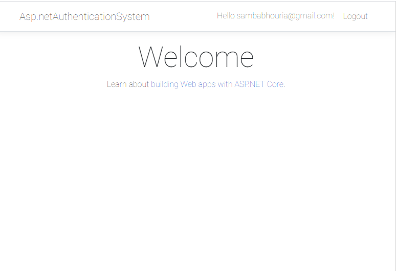
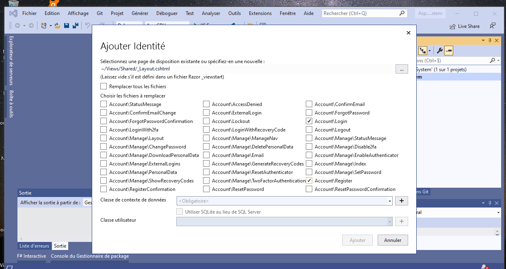

# ASP.NET Core MVC Login and Registration using Identity.
In this ASP.NET Core MVC tutorial, we implemented a complete authentication system with the help
of Identity.UI. We customized/ overridden the razor pages from the Identity API.
First of all, ASP.NET Core Identity is added to an existing project.
We could directly update/ override razor pages from Identity as per requirement.

### Points discussed:
- Getting started with Asp.Net Core Web App.
- Dependency Injection in Asp.Net Core.
- EF Core CRUD Operations using Code First Approach.

### `Screen shot`
 
 
 
 
